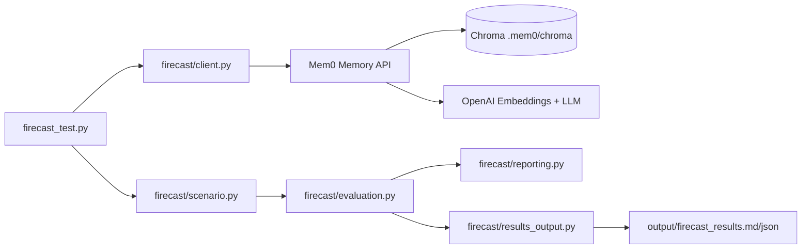

# Mem0 Product Evaluation Report

**Project:** Firecast Temporal Reasoning Test Suite (`bsv-mem0-testing`)  
**Product evaluated:** [Mem0](https://mem0.ai) — open-source / hosted AI memory layer for agents  
**Evaluation date:** May 15, 2026  
**Canonical test run:** 2026-05-15 08:15:35 UTC (fresh Chroma store)  
**Evaluator:** Hands-on technical evaluation via scripted test harness  

---

## Executive Summary

We built **Firecast**, a Python evaluation harness that exercises Mem0’s core `add`, `search`, and `get_all` APIs under realistic **temporal reasoning** scenarios (wildfire updates, relocation, budget revisions, health contradictions, plus an additive control). Setup required OpenAI API keys, ChromaDB, and careful handling of OpenAI project-level model access.

On our **canonical fresh-database run**, base Mem0 scored **3 of 5** cases passed:

| Result | Cases |
|--------|-------|
| **Pass** | `fire_distance`, `budget_update`, `additive_control` |
| **Fail** | `location_change`, `allergy_contradiction` |

Mem0 **correctly handles additive memory** and can **supersede** in some scenarios (`UPDATE` on budget; distance updated in place on fire). It **does not do so reliably**: location still keeps Austin and Denver side by side, and the allergy case **deleted** the allergy memory without storing the replacement—leaving **zero** retrievable facts. Earlier runs without a clean store scored **1/5** (all superseding cases failed with both facts in search), showing **high run-to-run variance**.

Mem0 aligns well with its mission as a developer-friendly memory layer for AI agents, but **conflict resolution and temporal awareness are inconsistent in the default configuration**, which limits reliability for safety-critical or fast-changing domains unless augmented (graph/temporal modes, custom prompts, or application-layer logic).

**Artifacts:** Full run output is saved automatically to `output/firecast_results.md` and `output/firecast_results.json`.

---

## 1. Hands-On Testing

### 1.1 What we built

We implemented a real-world-style **multi-scenario test project** rather than isolated API calls:

| Component | Purpose |
|-----------|---------|
| `firecast_test.py` | CLI entry point; runs full suite or `--case <name>` |
| `firecast/cases.py` | Five declarative test cases with markers and metadata |
| `firecast/scenario.py` | Generic flow: `add` → `add` → `search` → `get_all` |
| `firecast/evaluation.py` | Pass/fail rules for superseding vs additive behavior |
| `firecast/client.py` | Mem0 + Chroma configuration, `.env` loading, model fallbacks |
| `firecast/reporting.py` | Structured console output and suite summary |
| `firecast/results_output.py` | Writes per-run JSON and Markdown result files |
| `scripts/check_openai_access.py` | Pre-flight check for embedding and chat model access |

**Hypothesis under test:** Base Mem0 (vector search + LLM memory extraction) will **not** reliably detect that a newer fact supersedes an older one; it will merge silently, keep both, or return stale data.

### 1.2 Scenarios exercised

| Case | Scenario | Expected behavior |
|------|----------|-------------------|
| `fire_distance` | Wildfire 5 mi → 2 mi | Only current distance in search; stale removed or marked obsolete |
| `location_change` | Austin → Denver | Only current city |
| `budget_update` | $10k → $50k | Only revised budget |
| `allergy_contradiction` | Peanut allergy → cleared to eat peanut butter | Only current health status |
| `additive_control` | Hiking + coffee (non-conflicting) | **Both** facts stored and retrievable |

Each case uses a **distinct `user_id`** to avoid cross-test contamination in the vector store.

### 1.3 Setup and usability

**Steps performed:**

1. Created Python virtual environment and installed `mem0ai`, `chromadb`, `python-dotenv`.
2. Configured `.env` from `.env.example` with OpenAI API keys.
3. Resolved OpenAI **project-level model access** (embedding vs chat models often live on different projects).
4. Switched vector backend from default Qdrant to **Chroma** (local path `.mem0/chroma`) for simpler local development.
5. Ran `python scripts/check_openai_access.py`, then `python firecast_test.py`.
6. For reproducible baselines: `rm -rf .mem0/chroma` before a full suite run.

**Ease of setup — strengths:**

- Mem0’s Python API is small and intuitive: `Memory.from_config()`, `memory.add()`, `memory.search()`, `memory.get_all()`.
- LLM-based memory extraction produces clean, third-person fact strings automatically.
- Metadata (`event`, `distance_miles`, `ts`, etc.) attaches to memories without extra boilerplate.
- Test results export automatically to `output/` for reporting and PDF export.

**Ease of setup — friction points:**

| Issue | Impact |
|-------|--------|
| Default embedder (`text-embedding-3-small`) and LLM models may be **blocked per OpenAI project** | 403 errors until models are enabled or fallbacks configured |
| Default vector store (Qdrant) adds deployment complexity | We used Chroma locally instead |
| Mem0 also writes SQLite history under `~/.mem0/` | Occasional `readonly database` errors in restricted environments |
| Optional spaCy NLP (`mem0ai[nlp]`) not installed | Non-fatal warnings on startup |
| Dual-key setup (`OPENAI_API_KEY` + `OPENAI_LLM_API_KEY`) needed when embeddings and chat are on separate projects | Documented in our client, not obvious from Mem0 docs alone |
| `search()` / `get_all()` require `user_id` as a direct argument | Passing only `filters={"user_id": ...}` raises validation errors on current Mem0 versions |

**Overall UX rating:** Good for developers already using OpenAI; moderate friction for first-time local setup due to external dependencies and OpenAI project configuration.

### 1.4 Observed runtime behavior

**Configuration:** `text-embedding-3-small` + `gpt-4o-mini` (with separate keys for embeddings vs LLM where required).  
**Canonical run:** Fresh Chroma (`rm -rf .mem0/chroma`), ~48 seconds for full suite.

#### Suite results over time

| Run context | Score | Notes |
|-------------|-------|-------|
| Initial multi-case run (no clean store) | **1 / 5** | All four superseding cases failed: both stale and current in search; mostly `ADD` events |
| Fresh Chroma run (canonical) | **3 / 5** | See table below |
| Repeat fresh Chroma run | **3 / 5** | Same score; behavior stable at this snapshot |

#### Canonical run — case-by-case (2026-05-15 08:15:35 UTC)

| Case | Stored | Search | `add()` events | Verdict |
|------|--------|--------|--------------|---------|
| `fire_distance` | 4 memories | Only **2 mi** surfaced (no “5 miles” in search text) | Step 1: `ADD`×3; Step 2: `UPDATE` on distance + wind | **PASS (conditional)** — distance row updated; extra facts remain |
| `location_change` | 4 memories | **Both** Austin and Denver | Step 1–2: all `ADD` | **FAIL** — classic additive conflict |
| `budget_update` | 1 memory | Only **$50k** | Step 1: `ADD`; Step 2: `UPDATE` | **PASS** — true in-place supersede |
| `allergy_contradiction` | **0** memories | **Empty** search | Step 1: `ADD`; Step 2: `DELETE` only (no new fact added) | **FAIL (inconclusive)** — data loss, not supersede |
| `additive_control` | 2 memories | Both hiking and coffee | Step 1–2: `ADD` | **PASS** — expected additive behavior |

#### Interpretation

**What improved vs 1/5:** Mem0’s LLM extraction path sometimes emits **`UPDATE`** (fire distance, budget) instead of only **`ADD`**, so search no longer surfaces stale markers for those cases.

**What did not improve:** `location_change` still splits one sentence into multiple memories and never supersedes Austin. **`allergy_contradiction` regressed** on the fresh run: Step 2 deleted the allergy row but failed to add “cleared to eat peanut butter,” leaving the agent with **no** health memory at all.

**Pass criteria caveat:** `fire_distance` passes if search text lacks stale markers, even with 4 stored rows—marked **fragile / ranking-dependent** in the harness verdict.

---

## 2. Technical Evaluation

### 2.1 Performance

| Dimension | Observation |
|-----------|-------------|
| **Latency** | Full 5-case suite ~45–50 seconds on fresh Chroma (dominated by OpenAI embedding + LLM calls per `add`) |
| **Per-operation cost** | Each `add()` triggers LLM extraction; two adds + search + list per case ≈ 4+ API round-trips |
| **Local storage** | Chroma persists under `.mem0/chroma`; lightweight for dev, not evaluated at production scale |
| **Concurrency** | Not tested; sequential single-user scenarios only |

Mem0 is **not optimized for high-throughput, low-latency writes** in default mode because LLM inference is on the critical path for every memory ingestion.

### 2.2 Scalability and reliability

| Area | Assessment |
|------|------------|
| **Horizontal scaling** | Hosted Mem0 platform likely handles this; OSS local mode depends on chosen vector DB (Chroma, Qdrant, etc.) |
| **Multi-tenant isolation** | `user_id` scoping works; separate IDs per test case prevented leakage |
| **Consistency under updates** | **Inconsistent** — `UPDATE` in some cases, pure `ADD` in others, `DELETE`-without-replace in allergy |
| **Determinism** | LLM extraction and event type (`ADD` / `UPDATE` / `DELETE`) vary between runs; scores ranged 1/5 to 3/5 without code changes |
| **Stale store effects** | Reusing `.mem0/chroma` without reset can inflate or skew results; always reset for baseline comparisons |
| **Failure modes** | Missing model access → hard fail; SQLite permission issues → `add()` crash; over-aggressive `DELETE` → empty memory store |

### 2.3 Documentation review

| Topic | Clarity in official docs | Gap we hit in practice |
|-------|--------------------------|-------------------------|
| Quickstart / `Memory()` | Clear | Default models may not match user’s OpenAI project |
| Vector store options | Documented | Qdrant default is heavy for quick local eval |
| Temporal / graph memory | Mentioned for advanced tiers | No clear guidance on when base OSS supersedes vs merges |
| OpenAI multi-project keys | Limited | We added `OPENAI_LLM_API_KEY` and probe logic ourselves |
| `search` / `get_all` API | Partial | Must pass `user_id=` directly on current SDK |
| Conflict resolution semantics | Implicit | `UPDATE` and `DELETE` appear unpredictably; not documented as guarantees |

**Documentation score:** Adequate for getting started; **incomplete for temporal correctness guarantees** and production conflict policies.

### 2.4 Bugs and inefficiencies discovered

| ID | Severity | Description |
|----|----------|-------------|
| E-1 | **High** | Superseding behavior is **unreliable** — location keeps conflicting cities; scores vary 1/5–3/5 |
| E-2 | **High** | `DELETE` without replacement (allergy run) — **zero** memories after update; worse than keeping both |
| E-3 | **Medium** | Over-fragmentation: one user message → many `ADD` rows (fire: 4 memories; location: 4) |
| E-4 | **Medium** | Conditional passes hide stale data — fire passes search check while 4 rows remain stored |
| E-5 | **Medium** | Search ranking can still surface stale facts when `UPDATE` is not used (location) |
| E-6 | **Low** | spaCy optional dependency warnings if `mem0ai[nlp]` not installed |
| E-7 | **Low** | SQLite history DB under `~/.mem0/` can fail with permission errors in sandboxed environments |
| E-8 | **Info** | Harness marker mismatch possible (e.g. `"eats"` vs `"eat peanut butter"`) → false **INCONCLUSIVE** on otherwise correct text |
| E-9 | **Info** | Extra OpenAI cost/latency: LLM runs on every `add` even for simple factual updates |

---

## 3. Strategic Insights

### 3.1 Alignment with Mem0’s mission and market

Mem0’s stated mission is to give AI agents **persistent, personalized memory** so applications feel coherent across sessions. Our testing confirms strong alignment for:

- **Preference and profile accumulation** (hobbies, interests, stable facts) — `additive_control` passed consistently
- **RAG-style retrieval** of relevant past context
- **Developer velocity** — few lines of code to persist and query memories
- **Some factual updates** when the LLM chooses `UPDATE` (budget; fire distance)

Misalignment or risk appears when the product is used for **fast-changing state** without additional configuration:

- Emergency / crisis updates (fire passes search but stores multiple related rows)
- Relocation and identity changes (location still fails)
- Financial or medical status (budget can work; allergy can **wipe** memory entirely)

Mem0’s target market (AI startups, agent builders, SaaS embedding memory) is well served for **long-tail personalization**; **time-sensitive supersession** requires explicit product choices (graph memory, custom prompts, or app-layer invalidation) and **should not be inferred from a single pass rate**.

### 3.2 Competitive positioning

| Competitor / approach | Differentiation vs base Mem0 (our findings) |
|-----------------------|---------------------------------------------|
| **Raw vector DB + manual prompts** | Mem0 wins on extraction quality and API ergonomics |
| **LangChain / LlamaIndex memory modules** | Similar additive behavior unless custom merge logic added |
| **Mem0 Graph / temporal features** | Positioned as upgrade for relationship and time-aware memory—not evaluated in this harness |
| **Zep, Letta, custom knowledge graphs** | Often emphasize episode timelines and invalidation—gap where location/allergy failed |
| **Application-managed state** | Dev teams may bypass memory layer for “source of truth” fields (location, health) |

**Differentiation:** Mem0 is strong on **developer experience and LLM-native fact extraction**; **truth maintenance over time is inconsistent** in default OSS mode, with both false positives (dual facts) and false negatives (empty store after `DELETE`).

### 3.3 Areas for improvement

| Priority | Area | Recommendation |
|----------|------|----------------|
| P0 | Temporal / conflict handling | Detect contradictions on `add`; always `UPDATE` or replace—never `DELETE` without a successor memory |
| P0 | Search policy | Exclude superseded memories from search by default; don’t rely on ranking alone |
| P0 | Fragmentation | Merge related facts from one utterance into fewer rows where appropriate |
| P1 | Documentation | Document when `ADD` vs `UPDATE` vs `DELETE` occur; fresh-store testing guidance |
| P1 | Setup | Single-command local dev template (Chroma + model fallbacks + access checker) |
| P1 | API clarity | Document required `user_id` on `search` / `get_all` |
| P2 | Observability | Consistent, predictable `event` types in `add()` responses |
| P2 | Cost controls | Optional “raw store” path skipping LLM for structured updates |
| P3 | Test harness | Stem-aware marker matching (`eat` / `eats`); optional strict pass (require `UPDATE` + single stored row) |

---

## 4. Short Written Summary

We evaluated **Mem0** by building the **Firecast** test suite: five scenarios that mirror real agent memory needs, from wildfire alerts to budget and health updates. Setup was achievable in under an hour once OpenAI model access and Chroma were configured, and the Python API proved pleasant to use. Each run exports detailed results to `output/firecast_results.md` for audit and PDF reporting.

On a **fresh-database canonical run**, Mem0 scored **3 of 5**: it passed additive memory, budget supersession (`UPDATE` in place), and wildfire distance (conditional pass with `UPDATE` on the distance row but four total memories stored). It failed location (both Austin and Denver in search, all `ADD` events) and allergy (Step 2 issued `DELETE` without adding the cleared-to-eat-peanut-butter fact, leaving **no** retrievable memories). An earlier run without resetting Chroma scored **1/5**, demonstrating that **pass rate alone is not a stable product metric**—teams must test on clean stores and across multiple runs.

**Base Mem0 excels at additive memory** and **can** supersede in favorable cases, but **must not be trusted as a single source of truth** for fast-changing or safety-critical fields without graph/temporal features, custom prompts, or application-layer validation. Mem0 remains a compelling choice for personalized agent memory at speed of integration, with the main gap being **predictable, documented conflict resolution** rather than raw retrieval quality.

---

## Appendix A: How to reproduce

```bash
cd bsv-mem0-testing
python -m venv .venv
source .venv/bin/activate   # Windows: .venv\Scripts\activate
pip install -r requirements.txt
cp .env.example .env        # add real OPENAI_API_KEY (and optional OPENAI_LLM_API_KEY)
python scripts/check_openai_access.py

# Recommended: clean store for baseline
rm -rf .mem0/chroma
python firecast_test.py

# Outputs (auto-generated):
#   output/firecast_results.md
#   output/firecast_results.json

python firecast_test.py --case fire_distance   # single case
python firecast_test.py --output reports/run1  # custom output path
```

## Appendix B: Evaluation criteria mapping

| Criterion | Section |
|-----------|---------|
| Hands-on testing (setup, usability, real scenario) | §1 |
| Technical evaluation (performance, scalability, docs, bugs) | §2 |
| Strategic insights (mission, competition, improvements) | §3 |
| Short written summary | §4 |

## Appendix C: Architecture (test harness)



## Appendix D: Canonical run summary (2026-05-15)

```
SUITE SUMMARY
  fire_distance: PASS
  location_change: FAIL
  budget_update: PASS
  allergy_contradiction: FAIL
  additive_control: PASS

3/5 cases passed.
```

See `output/firecast_results.md` for full step-by-step JSON and verdicts.

---

*This report reflects hands-on testing performed in May 2026 using the open-source Mem0 Python SDK with local Chroma storage and OpenAI-backed embedding and extraction models. Canonical metrics are from fresh Chroma runs; earlier 1/5 results are retained as evidence of run-to-run variance.*
